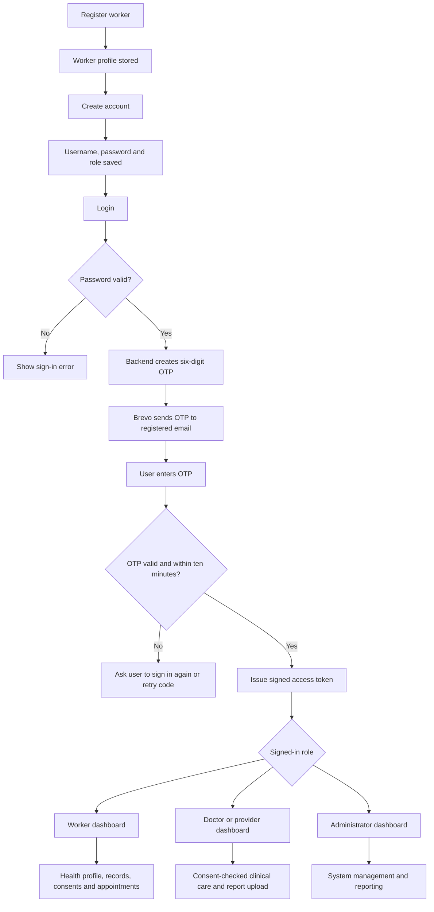
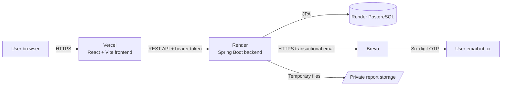

# Digital Health Record Tool

A web application for securely managing health information for migrant workers in Kerala. It provides a worker registration flow, account-based access, one-time-password (OTP) login, health profiles, clinical records, medical reports, appointments, consent management, notifications, and role-aware dashboards.

## Live application

- Frontend: [Kerala Health](https://frontend-one-rosy-77.vercel.app)
- Backend API: [digital-health-api](https://digital-health-api.onrender.com)
- Source repository: [DIGITAL-HEALTH-RECORD-TOOL](https://github.com/DineshDev812/DIGITAL-HEALTH-RECORD-TOOL)

## What the toolkit does

The application keeps each worker's records in one place while giving workers control over who can access them.

| Role | Main capabilities |
| --- | --- |
| Worker | Create an account linked to a worker profile, sign in with email OTP, view personal health information, manage consents, and book or view appointments. |
| Doctor | View a worker's records only when an active consent exists, then add clinical records and participate in appointments. |
| Healthcare provider | Access consented worker information, upload medical reports, add records, and manage appointments. |
| Administrator | Manage workers, healthcare centres, users, and system-wide dashboard information. |

## Workflow



### Login and OTP sequence

1. The user enters their username and password on the Vercel frontend.
2. The frontend sends the request to the Spring Boot API hosted on Render.
3. The backend validates the account and BCrypt password hash.
4. If valid, the backend generates a six-digit OTP that expires after 10 minutes.
5. The backend calls Brevo's HTTPS transactional-email API to send the OTP to the account's registered email address.
6. The user enters the OTP. The backend permits up to five incorrect attempts.
7. A successful OTP check issues an access token that the frontend stores locally and sends with later protected requests.

## Architecture



## Main features

- Migrant-worker registration with identity, contact, location, occupation, employer, and emergency-contact information.
- Worker-linked accounts with Worker, Doctor, Healthcare Provider, and Administrator roles.
- Email OTP sign-in with a six-digit, 10-minute code and retry protection.
- Digital health profiles and structured health records.
- Consent-based clinical access so a provider must have active worker consent.
- Appointment booking and status management.
- Medical-report upload for PDF, PNG, and JPEG files up to 10 MB.
- Worker QR code generation and notifications.
- Malayalam, Hindi, Tamil, Bengali, and English interface options.

## New user guide

Follow these steps when using the toolkit for the first time:

1. Open the [Kerala Health application](https://frontend-one-rosy-77.vercel.app).
2. Select **Register worker** and enter the worker's personal, contact, and employment details.
3. Select **Register worker** to create the worker profile. Save the Worker ID shown by the application.
4. Select **Create account**.
5. Enter a username, an email address that the user can access, and a password of at least eight characters.
6. Choose **Worker** as the role and enter the Worker ID from step 3.
7. Select **Create secure account**.
8. Return to **Login**, enter the username and password, and select **Send verification code**.
9. Open the registered email inbox (including the Spam folder if necessary) and find the six-digit OTP.
10. Enter the OTP in the application and select **Verify and sign in**.

After signing in, a worker can view their health profile and records, manage consent permissions, view notifications, and book or review appointments.

## Repository structure

```text
.
├── frontend/                React + Vite single-page application
│   ├── src/                 Screens, API client, services, translations, styles
│   └── vercel.json          Public Vercel deployment configuration
├── backend/                 Spring Boot API
│   ├── src/main/java/       Controllers, services, security, models, repositories
│   ├── src/main/resources/  Application configuration
│   └── Dockerfile           Render container build
└── render.yaml              Render web service and PostgreSQL blueprint
```

## Run locally

### Prerequisites

- Node.js 18 or newer
- Java 17
- Maven 3.9 or newer

### Start the backend

```bash
cd backend
mvn spring-boot:run
```

The local API runs on `http://localhost:8081` by default. Without database variables, it uses a local H2 database.

### Start the frontend

```bash
cd frontend
npm install
npm run dev
```

Open the address shown by Vite, normally `http://localhost:5173`.

For a local frontend to target a different API, create `frontend/.env.local`:

```env
VITE_API_URL=http://localhost:8081/api
```

## Deployment configuration

### Frontend on Vercel

Set this Vercel environment variable before building:

```env
VITE_API_URL=https://digital-health-api.onrender.com/api
```

Vite embeds this value during the frontend build, so redeploy the frontend after changing it.

### Backend on Render

The `render.yaml` blueprint creates a Docker web service and PostgreSQL database. Configure these environment variables in the Render service:

| Variable | Purpose |
| --- | --- |
| `DATABASE_URL` | Render PostgreSQL connection string. |
| `CORS_ALLOWED_ORIGIN_PATTERNS` | Public frontend origin, for example `https://frontend-one-rosy-77.vercel.app`. |
| `BREVO_API_KEY` | Brevo API key used for transactional OTP email. Keep secret. |
| `MAIL_FROM` | A verified Brevo sender email address. |
| `MEDICAL_REPORT_STORAGE` | Private storage directory used for uploaded reports. |

`MAIL_USERNAME` and `MAIL_PASSWORD` are legacy SMTP variables and are not required for the current Brevo HTTPS email implementation.

### Brevo requirements for OTP email

1. Create a Brevo API key in **SMTP & API**.
2. Add and verify the sender used for `MAIL_FROM`.
3. If deploying on Render Free, disable Brevo's **Blocking unauthorized IP addresses for API keys** setting. Render Free does not provide a fixed outbound IP address.
4. Save the key as `BREVO_API_KEY` in Render and wait for the service to redeploy.

The backend exposes a non-sensitive readiness check at `/api/auth/email-status`. It reports whether Brevo accepts the configured key, without returning the key or email content.

## Important production notes

- Render Free services spin down after inactivity, so the first request after inactivity can take longer.
- Render Free databases and temporary filesystem storage have service-plan limitations. Use paid persistent storage and regular database backups before using the system for real medical operations.
- Never store API keys, passwords, OTPs, or personal medical files in Git.
- This project demonstrates a health-record workflow. A real clinical deployment requires formal privacy, security, consent, audit, backup, and regulatory review.

## API overview

| Area | Base route | Notes |
| --- | --- | --- |
| Authentication | `/api/auth` | Register, start login, verify OTP, email readiness. |
| Workers | `/api/workers` | Worker profile creation and role-protected access. |
| Health profile | `/api/workers/{workerId}/health-profile` | Personal health data. |
| Clinical records | `/api/workers/{workerId}/records` | Consent-protected health records. |
| Medical reports | `/api/workers/{workerId}/reports` | Protected report upload and download. |
| Appointments | `/api/workers/{workerId}/appointments` | Booking and status updates. |
| Consents | `/api/workers/{workerId}/consents` | Worker-controlled clinical access. |
| Notifications | `/api/workers/{workerId}/notifications` | Worker notification list and read status. |

## Support checklist

If OTP email does not arrive:

1. Confirm the Render backend is **Live**.
2. Open `https://digital-health-api.onrender.com/api/auth/email-status`; it should return `"ready": true` and `"providerStatus": 200`.
3. Confirm the Brevo sender in `MAIL_FROM` is verified.
4. Confirm unauthorized-IP blocking for Brevo API keys is deactivated when using Render Free.
5. Check the registered account email and spam folder.
